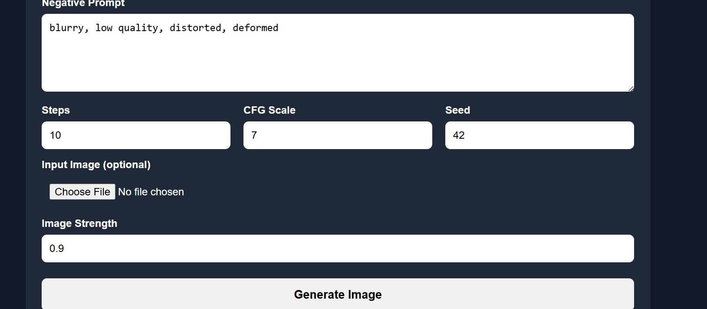
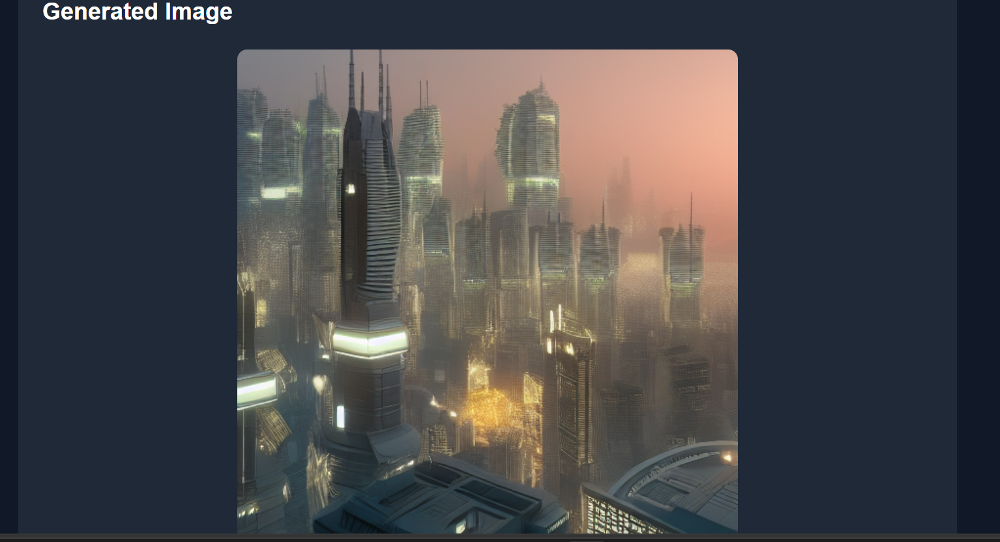

# 🎨 Stable Diffusion Web Application


A custom **Stable Diffusion web application** built with **FastAPI, PyTorch, and Docker**.

The application provides an interactive web interface for generating AI images using a custom Stable Diffusion model.

## ✨ Highlights

- 🖼️ Text-to-image generation
- 🎨 Image-to-image generation
- ⚙️ Adjustable inference settings
- 🎲 Reproducible generation using seeds
- 📚 Generation history and gallery
- 🐳 Fully Dockerized application
- 🚀 REST API powered by FastAPI

---

# Features

- Text-to-image generation
- Image-to-image generation
- Negative prompts
- Adjustable inference steps
- CFG scale control
- Seed control
- Image strength control
- Generated image download
- Generation history/gallery
- FastAPI backend
- Docker support

---

# Project Structure

```text
pytorch-stable-diffusion/
│
├── app.py
├── Dockerfile
├── docker-compose.yml
├── requirements.txt
├── README.md
│
├── data/
│   ├── vocab.json
│   ├── merges.txt
│   └── v1-5-pruned-emaonly.ckpt
│
├── templates/
│   └── index.html
│
├── sd/
│   ├── pipeline.py
│   ├── model_loader.py
│   ├── ddim.py
│   └── ...
│
├── outputs/
│   └── Generated images
│
└── screenshots/
    ├── generation-history.png
    └── generated-image.png
```

---

# Requirements

- Docker Desktop
- Docker Compose
- Stable Diffusion model checkpoint

---

## Environment Configuration

The project includes a `.env.example` file containing example configuration values.

Create your own `.env` file:

```powershell
Copy-Item .env.example .env
```

---


# Model Files

The Stable Diffusion checkpoint is not included in this repository because the model file is several GB in size.

Place the model checkpoint inside:

```text
data/
```

The expected model filename is:

```text
v1-5-pruned-emaonly.ckpt
```

The directory should look like:

```text
data/
├── vocab.json
├── merges.txt
└── v1-5-pruned-emaonly.ckpt
```

---

# Installation

## Clone the Repository

```bash
git clone https://github.com/tusharsoni8102-byte/stable-diffusion-web-app.git
```

Move into the project directory:

```bash
cd stable-diffusion-web-app
```

---

# Run with Docker

Make sure Docker Desktop is running.

Build and start the application:

```bash
docker compose up --build
```

The first build may take several minutes because Docker installs PyTorch and the required dependencies.

Once the application starts successfully, you should see something similar to:

```text
Uvicorn running on http://0.0.0.0:8000
```

---

# Access the Web Application

Open your browser and visit:

```text
http://localhost:8000/app
```

The application allows you to:

1. Enter a text prompt
2. Add a negative prompt
3. Adjust generation steps
4. Adjust CFG scale
5. Set a seed
6. Optionally upload an input image
7. Adjust image strength
8. Generate images
9. Download generated images
10. View generation history

---

# API Endpoints

## Application

```text
GET /app
```

Opens the Stable Diffusion web interface.

## Generate Image

```text
POST /generate
```

Generates an image using the Stable Diffusion model.

Parameters include:

- `prompt`
- `negative_prompt`
- `steps`
- `cfg_scale`
- `seed`
- `input_image`
- `strength`

## Gallery

```text
GET /gallery
```

Returns previously generated images.

## Outputs

Generated images are available through:

```text
/outputs/<filename>
```

---

# Generated Images

Generated images are automatically saved in:

```text
outputs/
```

Example filename:

```text
generated_20260908_064019_42.png
```

---

# Example Workflow

1. Start Docker Desktop.
2. Run:

```bash
docker compose up --build
```

3. Open:

```text
http://localhost:8000/app
```

4. Enter a prompt such as:

```text
A futuristic city at sunset, cinematic lighting, highly detailed
```

5. Add a negative prompt such as:

```text
blurry, low quality, distorted, deformed
```

6. Adjust the generation settings.

7. Click **Generate Image**.

8. The generated image will appear in the web interface and be saved in the `outputs/` directory.

---

# Screenshots

## Stable Diffusion Web Interface and Generation History



## Generated Image Example



---

# Technologies Used

- Python
- FastAPI
- PyTorch
- Stable Diffusion
- Hugging Face Transformers
- Pillow
- Docker
- Docker Compose
- HTML
- CSS
- JavaScript

---

# Notes

The application automatically selects CUDA when a compatible GPU is available:

```python
DEVICE = "cuda" if torch.cuda.is_available() else "cpu"
```

When GPU acceleration is unavailable, the application automatically falls back to CPU inference.

Image generation on CPU may take significantly longer than GPU-based inference.

GPU acceleration requires compatible NVIDIA hardware, drivers, and a Docker/PyTorch environment with GPU access.
---

# 🚀 Deployment

## Local Deployment

This project is currently configured for local deployment using Docker.

### 1. Clone the repository

```bash
git clone https://github.com/tusharsoni8102-byte/stable-diffusion-web-app.git
cd stable-diffusion-web-app
```

### 2. Add the Stable Diffusion model

Place the model checkpoint inside:

```text
data/
```

The expected filename is:

```text
v1-5-pruned-emaonly.ckpt
```

### 3. Start the application

```bash
docker compose up --build
```

### 4. Open the application

```text
http://localhost:8000/app
```

## Global Deployment

The application can be deployed to a GPU-enabled cloud environment.

Stable Diffusion inference requires significant computational resources, and cloud GPU services may incur usage costs. For this reason, the project is currently documented and tested primarily for local Docker-based execution.

---

# Author

**Tushar Soni**

GitHub:

https://github.com/tusharsoni8102-byte